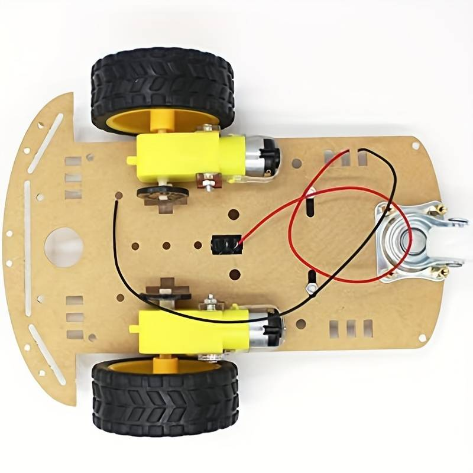
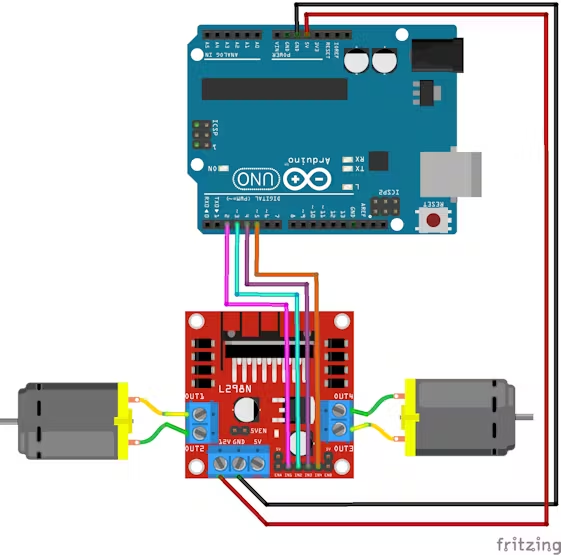

# Self Driving Car.

## [x] 2 DC motors connected to batteries through a switch

    - Schema:
    

## [x] Connect arduino to the motors through an L298N Driver

    - Schema:
    

    - Simple tutorial:
    https://www.hackster.io/ryanchan/how-to-use-the-l298n-motor-driver-b124c5

## [ ] HC-SR04 sensors for object detection
